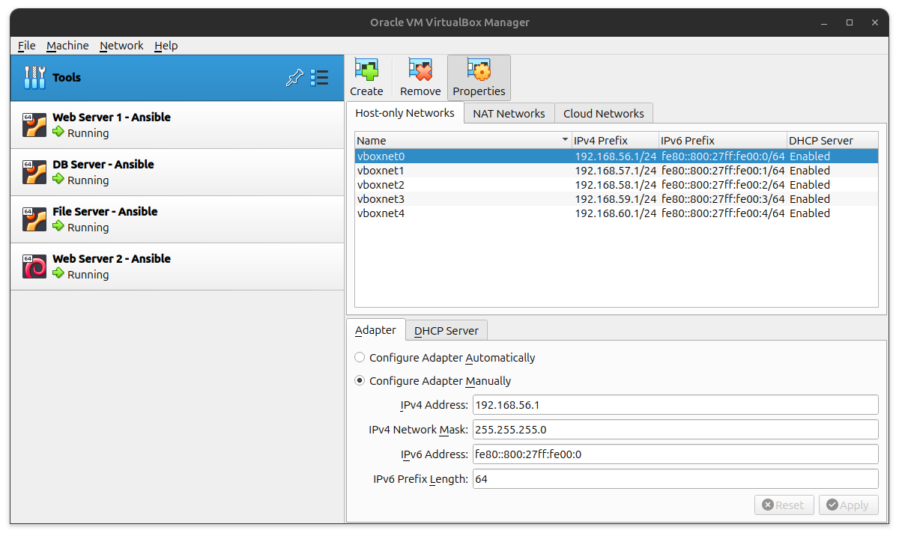
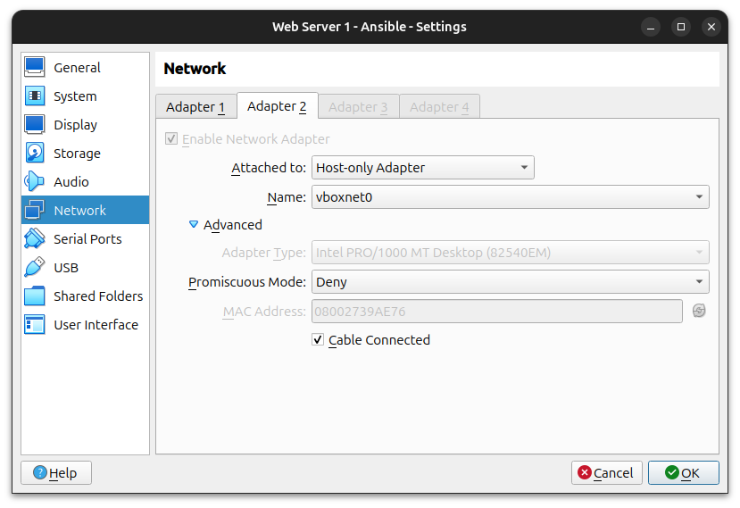
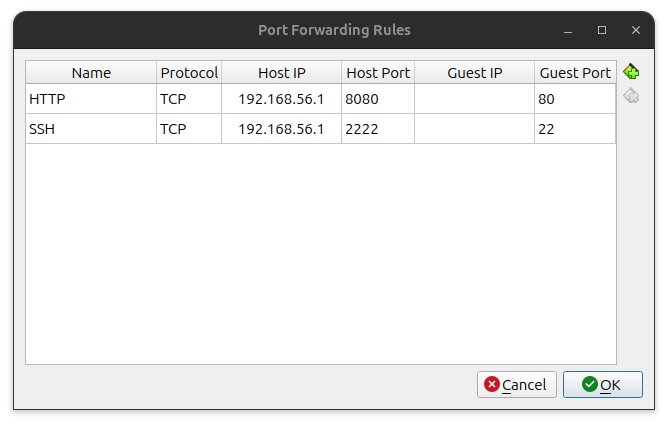

# setup_linux_servers_ansible

Setup Linux servers via Ansible.

## List of Virtual Machines

Ubuntu Server 1:
- Name: Web Server 1
- IP Address: 192.168.56.1
	- Attached to: Host-only Adapter
	- Name vboxnet0
- OS: Ubuntu Server

Ubuntu Server 2:
- Name: DB Server
- IP Address: 192.168.57.1
	- Attached to: Host-only Adapter
	- Name vboxnet1
- OS: Ubuntu Server

Ubuntu Server 3:
- Name: File Server
- IP Address: 192.168.58.1
	- Attached to: Host-only Adapter
	- Name vboxnet2
- OS: Ubuntu Server

Debian Server 1:
- Name: Web Server 2
- IP Address: 192.168.59.1
	- Attached to: Host-only Adapter
	- Name vboxnet3
- OS: Debian

## Virtual Machine Setup

Create five Host-only networks and make sure DHCP Server is enabled:



Go to VM setting -> Network -> Adapter 2
Enable Network Adapter for each VM. Set the Attached to option to Host-only Adapter. Set the Name option to the right Host-only Network name.



Go to VM setting -> Network -> Adapter 1 -> Advanced -> Port Forwarding
Set the port forwarding for each VM like this:



Make sure the IP address is the correct one for each VM.

## Installation 

Install the ansible package on Fedora
```
sudo dnf install ansible
```

Install openssh server on Ubuntu servers
```
sudo apt install openssh-server
```

Install openssh server on Debian servers
```
sudo dnf install openssh-server
```

## Setup SSH Keys

### Linux Servers Key

Create ssh key for the linux servers
```
ssh-keygen -t ed25519 -C "salmaan default"
```

The file path for the private key should be:
```
/home/salmaan/.ssh/linux_servers_ansible
```

Copy the linux servers ssh key to the linux servers. Replace the ip address to the ip address of the linux servers.
```
ssh-copy-id -p 2222 -i ~/.ssh/linux_servers_ansible.pub sage@192.168.56.1
```

Check if performing ssh to the linux servers occurs automatically without a password confirmation
```
ssh -p 2222 sage@192.168.56.1
```

### Ansible Key

Create the ssh key for ansible
```
ssh-keygen -t ed25519 -C "ansible"
```

The file path for the private key should be:
```
/home/salmaan/.ssh/ansible
```

Copy the ansible ssh key to the linux servers. Replace the ip address to the ip address of the linux servers.
```
ssh-copy-id -p 2222 -i ~/.ssh/ansible.pub sage@192.168.56.1
```

Check if performing ssh to the linux servers with the ansible ssh key occurs automatically without a password confirmation
```
ssh -p 2222 -i ~/.ssh/ansible 192.168.56.1
```

## Setup and configure Ansible

Ping all of the hosts
```
ansible all -m ping
```

List all of the hosts
```
ansible all --list-hosts
```

Gather facts about the target systems
```
ansible all -m gather_facts
```

Gather facts about a particular target system
```
ansible all -m gather_facts --limit 192.168.56.1
```

## Running Elevated Commands with Ansible

Make ansible use sudo with --ask-become-pass
```
ansible all -m apt -a update_cache=true --become --ask-become-pass
```

Install the vim package via the apt module
```
ansible all -m apt -a name=vim --become --ask-become-pass
```

Install the snapd package and make sure it's the latest version available
```
ansible all -m apt -a "name=snapd state=latest" --become --ask-become-pass
```

Upgrade all the package updates that are available via apt
```
ansible all -m apt -a upgrade=dist --become --ask-become-pass
```

## Writing and Running an Ansible Playbook

Run the bootstrap playbook
```
ansible-playbook --ask-become-pass bootstrap.yml
```

Run the site playbook
```
ansible-playbook --become --ask-become-pass site.yml
```

## Linux Terminal Tips and Tricks

Get the information of the Operating System on Linux
```
cat /etc/os-release
```

List all users
```
compgen -u
```

List last 20 users
```
tail -n 20 /etc/passwd
```

## The When Conditional

Get the ansible_distribution information for a Linux server
```
ansible all -m gather_facts --limit 192.168.56.1 | grep ansible_distribution
```

## Virtual Box Commands

List virtual machines and their UUID
```
vboxmanage list vms
```

List the running virtual machines
```
vboxmanage list runningvms
```

## Ansible Tags

List available tags in a playbook
```
ansible-playbook --list-tags site.yml
```

Running a playbook while targeting specific tags
```
ansible-playbook --tags db --ask-become-pass site.yml
ansible-playbook --tags debian --ask-become-pass site.yml
ansible-playbook --tags apache --ask-become-pass site.yml
```

Running a playbook while specifying multiple tags
```
ansible-playbook --tags "apache,db" --ask-become-pass site.yml
```

## VirtualBox Conflicts with KVM (Linux)

### Disable KVM for the Current Session

You should disable the kvm modules for VirtualBox to work on Linux.

If you are using an Intel CPU, disable the `kvm_intel` module
```
sudo modprobe -r kvm_intel
```

If you are using an AMD CPU, disable the `kvm_amd` module
```
sudo modprobe -r kvm_amd
```

Check the kvm modules is disabled
```
lsmod | grep kvm
```

You should see no output

### Disable KVM Permanently

If you want to disable the kvm modules permanently, create the `/etc/modprobe.d/blacklist.conf` file
```
sudo touch /etc/modprobe.d/blacklist.conf
```

Open the  `/etc/modprobe.d/blacklist.conf` file
```
sudo vim /etc/modprobe.d/blacklist.conf
```

The `/etc/modprobe.d/blacklist.conf` file should look like this
```
blacklist kvm_intel
```

If you are using an AMD CPU, replace `kvm_intel` with `kvm_amd`

Reboot the PC and the kvm modules should not be running

Check the kvm modules is disabled
```
lsmod | grep kvm
```

You should see no output

## Resources
- [Ansible community documentation - Ansible](https://docs.ansible.com/)
- [VirtualBox can't operate in VMX mode - superuser](https://superuser.com/questions/1845776/virtualbox-cant-operate-in-vmx-mode)